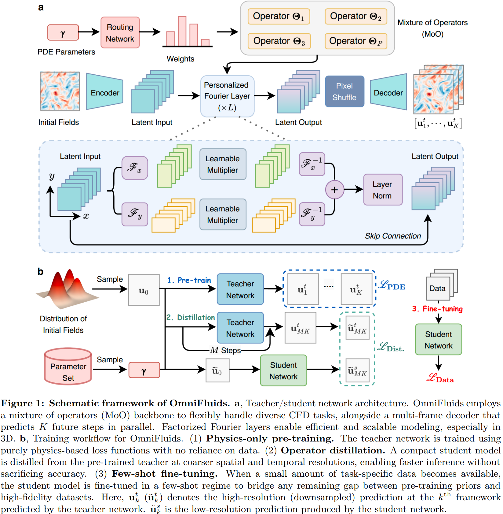

# OmniFluids: Physics Pre-trained Modeling of Fluid Dynamics

This repository contains the code for the paper
- **OmniFluids: Physics Pre-trained Modeling of Fluid Dynamics**

## Abstract
Computational fluid dynamics (CFD) drives progress in numerous scientific and engineering fields, yet high-fidelity simulations remain computationally prohibitive. While machine learning approaches offer computing acceleration, they typically specialize in single physical systems or require extensive training data, hindering their applicability in highly nonlinear and 3D flow scenarios. To overcome these limitations, we propose OmniFluids, a pure physics pre-trained model that captures fundamental fluid dynamics laws and adapts efficiently to diverse downstream tasks with minimal data. We develop a training framework combining physics-only pre-training, coarse-grid operator distillation, and few-shot fine-tuning. This enables OmniFluids to retain broad physics knowledge while delivering fast and accurate predictions. Architecturally, OmniFluids integrates a mixture of operators, a multi-frame decoder, and factorized Fourier layers, seamlessly incorporating physics-based supervision while allowing efficient and scalable modeling of diverse tasks. Extensive tests on a broad range of 2D and 3D benchmarks show that OmniFluids outperforms state-of-the-art AI-driven methods in terms of flow field prediction and turbulence statistics. It delivers 10--100x speedups over traditional solvers while maintaining a comparable accuracy and accurately identifies unknown physical parameters from sparse, noisy data. This work demonstrates the potential of training a unified CFD solver exclusively from physics knowledge, offering a new approach for efficient and generalizable modeling across complex fluid systems.



## Quick Start

1. Generate dataset in the `data` folder:
```bash
python main.py
```
2. Physics-only pre-train in the `pretrain` folder:
```bash
python main.py  
```
3. Operator distillation in the `distillation` folder:
```bash
python main.py  --model_path <The path of pre-trained model>
```
4. Few-shot fine-tuning in the `finetuning` folder:
```bash
python main.py  --model_path <The path of distilled model>
```

## Citation

If you find our work useful in your research, please consider citing:
```
@article{zhang2025omnifluids,
  title={OmniFluids: Physics Pre-trained Modeling of Fluid Dynamics},
  author={Zhang, Rui and Meng, Qi and Wan, Han and Liu, Yang and Ma, Zhi-Ming and Sun, Hao},
  journal={arXiv preprint arXiv:2506.10862},
  year={2025}
}
```

If you have any questions, please feel free to contact me via: rayzhang@ruc.edu.cn
